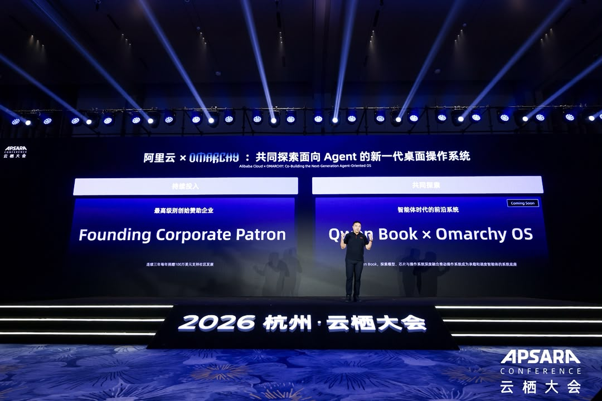

[Alibaba Cloud](https://www.alibabacloud.com/) is joining the [Omacom Foundation](/foundation/) as a **[Founding Corporate Patron](/patrons/#founding-token-patrons)**, contributing **$1 million a year for three years**! That's a $3 million commitment, matching [DigitalOcean's backing](/news/2026/09/digitalocean-joins-as-founding-corporate-patron/), to the development, maintenance, and spread of Omarchy.

But this partnership goes well beyond the money. Alibaba Cloud is going to help us build **[Omarchy China](https://omarchy.cn/)**: the local CDN, hosting, website, meetups, and community that Chinese users need to adopt Omarchy without hassle. Downloading Linux, installing packages, and keeping your computer up to date should be straightforward wherever you live. We're going to work together on making that true in China too.

And the timing couldn't be better. With the announcement of **[Qwen Book](https://www.qianwenai.com/product/qwenbook)**, Alibaba is putting its ambition for the agentic computer into hardware. We're going to collaborate on making Omarchy the ideal agentic operating system for that computer. A beautiful, fun Linux desktop where people and agents can work together, and where the owner remains in charge.

Here's how Alibaba Cloud describes the upcoming Qwen Book:

> Qwen Book aims to create a native AI agent computer. Its core philosophy, “OS as Harness,” simply put, involves deeply integrating models, the operating system, applications, cloud services, and hardware. This builds a computing environment that agents can understand, invoke, remember, and run in continuously, upgrading the computer from a passive tool into a constantly evolving personal assistant.
>
> The Qwen Book system is compatible with both ARM and x86 architectures, with the first release based on the ARM architecture. At the system level, we have built a low-power Agent Engine and a Continuous Context Engine. With the Qwen model family as the intelligent foundation, we provide model services for the Qwen Book system through cloud-device integration. We look forward to exploring more innovations together with Omarchy OS in the future.

That means tuning Omarchy for [Qwen models](https://github.com/QwenLM) out of the box and working toward full integration with the Chinese services people depend on. The models, the operating system, and the services should work together from the moment you start the machine. Getting your computer ready to work with an agent shouldn't be a project in itself.

This is exactly the kind of collaboration I want the foundation to make possible. People who build models, people who build computers, and people who build operating systems working together to make the whole experience better. We have a shared ambition for what the personal computer can become, and now we're putting resources behind it.

[Alibaba Cloud joins DigitalOcean and Meta Superintelligence Labs as a Founding Corporate Patron](/patrons/#founding-token-patrons). Their pledge brings our [total backing to approximately **$21.7 million**](/news/2026/08/omacom-foundation-launches-with-8-million/). That's more room to invest in the people, infrastructure, and open-source projects that make Omarchy possible.

Thank you to everyone at Alibaba Cloud, and especially to CTO LI feifei, who made this possible. Your backing lets us think bigger and put more people to work on making Linux better for everyone.

Let's build the ideal agentic operating system for the agentic computer. In China and everywhere else!

PS: I'm going to China to speak at the [GOSIM conference](https://shenzhen2026.gosim.org/speakers/dhh/), and will be attending the [Omarchy Meetup in Shenzhen](https://luma.com/j7eekqe6) too. I'll also be visiting Alibaba in Hangzhou, and going to Beijing. Can't wait!
